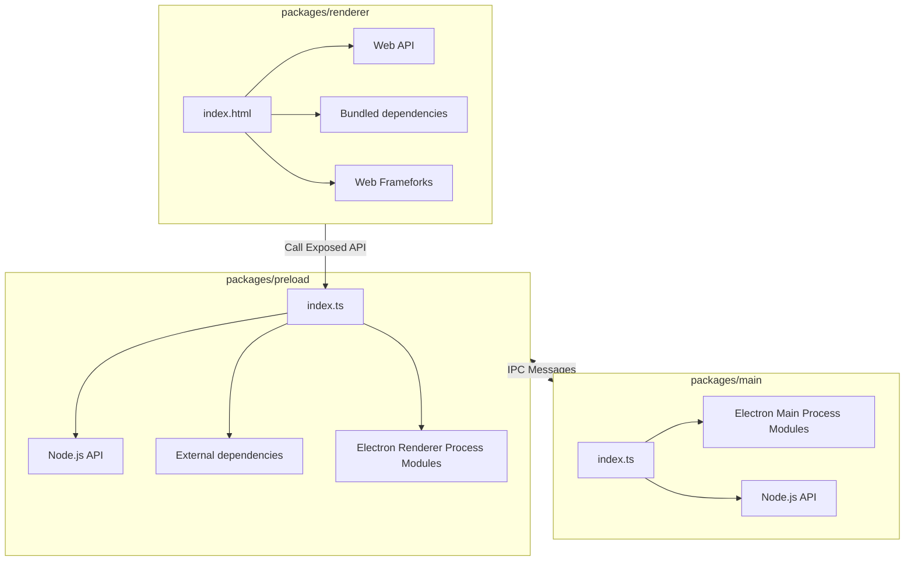
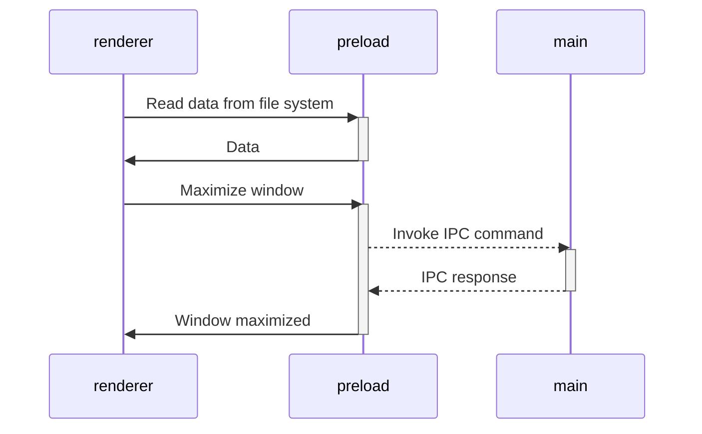

# Vite Electron Builder Boilerplate

> Vite+Electron = 🔥

This is template for secure electron applications. Written following the latest safety requirements, recommendations and best practices. base on [@cawa-99](https://github.com/cawa-93/)'s [vite-electron-builder](https://github.com/cawa-93/vite-electron-builder)

Renderer view use Vue + Vite template based on [@antfu](https://github.com/antfu)'s [Vitesse](https://github.com/antfu/vitesse) but without markdown

Under the hood is used [Vite] — superfast, nextgen bundler, and [electron-builder] for compilation.

<br>

## Features

- 💻 [Electron](https://www.electronjs.org), [electron-builder](https://github.com/electron-userland/electron-builder) - build cross-platform desktop app

- ⚡️ [Vue 3](https://github.com/vuejs/vue-next), [Vite 2](https://github.com/vitejs/vite), [pnpm](https://pnpm.js.org/), [ESBuild](https://github.com/evanw/esbuild) - born with fastness


- 🗂 [File based routing](./src/pages)

- 📦 [Components auto importing](./src/components)

- 🍍 [State Management via Pinia](https://pinia.esm.dev/)

- 📑 [Layout system](./src/layouts)

- 🎨 [UnoCSS](https://github.com/antfu/unocss) - the instant on-demand atomic CSS engine

- 😃 [Use icons from any icon sets with classes](https://github.com/antfu/unocss/tree/main/packages/preset-icons)

- 🌍 [I18n ready](./locales)

- 🔥 Use the [new `<script setup>` syntax](https://github.com/vuejs/rfcs/pull/227)

- 🤙🏻 [Reactivity Transform](https://vuejs.org/guide/extras/reactivity-transform.html) enabled

- 📥 [APIs auto importing](https://github.com/antfu/unplugin-auto-import) - use Composition API and others directly

- 🖨 Static-site generation (SSG) via [vite-ssg](https://github.com/antfu/vite-ssg)

- 🦔 Critical CSS via [critters](https://github.com/GoogleChromeLabs/critters)

- 🦾 TypeScript, of course

- ⚙️ Unit Testing with [Vitest](https://github.com/vitest-dev/vitest), E2E Testing with [Cypress](https://cypress.io/) on [GitHub Actions](https://github.com/features/actions)

<br>

## Pre-packed

### UI Frameworks

- [UnoCSS](https://github.com/antfu/unocss) - The instant on-demand atomic CSS engine.

### Icons

- [Iconify](https://iconify.design) - use icons from any icon sets [🔍Icônes](https://icones.netlify.app/)
- [Pure CSS Icons via UnoCSS](https://github.com/antfu/unocss/tree/main/packages/preset-icons)

### Plugins

- [Vue Router](https://github.com/vuejs/vue-router)
  - [`vite-plugin-pages`](https://github.com/hannoeru/vite-plugin-pages) - file system based routing
  - [`vite-plugin-vue-layouts`](https://github.com/JohnCampionJr/vite-plugin-vue-layouts) - layouts for pages
- [Pinia](https://pinia.esm.dev) - Intuitive, type safe, light and flexible Store for Vue using the composition api
- [`unplugin-vue-components`](https://github.com/antfu/unplugin-vue-components) - components auto import
- [`unplugin-auto-import`](https://github.com/antfu/unplugin-auto-import) - Directly use Vue Composition API and others without importing
- [Vue I18n](https://github.com/intlify/vue-i18n-next) - Internationalization
  - [`vite-plugin-vue-i18n`](https://github.com/intlify/vite-plugin-vue-i18n) - Vite plugin for Vue I18n
- [VueUse](https://github.com/antfu/vueuse) - collection of useful composition APIs
- [`@vueuse/head`](https://github.com/vueuse/head) - manipulate document head reactively

### Coding Style

- Use Composition API with [`<script setup>` SFC syntax](https://github.com/vuejs/rfcs/pull/227)
- [ESLint](https://eslint.org/) with [@antfu/eslint-config](https://github.com/antfu/eslint-config), single quotes, no semi.

### Dev tools

- [TypeScript](https://www.typescriptlang.org/)
- [Vitest](https://github.com/vitest-dev/vitest) - Unit testing powered by Vite
- [Cypress](https://cypress.io/) - E2E testing
- [pnpm](https://pnpm.js.org/) - fast, disk space efficient package manager
- [`vite-ssg`](https://github.com/antfu/vite-ssg) - Static-site generation
  - [critters](https://github.com/GoogleChromeLabs/critters) - Critical CSS
- [VS Code Extensions](./.vscode/extensions.json)
  - [Vite](https://marketplace.visualstudio.com/items?itemName=antfu.vite) - Fire up Vite server automatically
  - [Volar](https://marketplace.visualstudio.com/items?itemName=johnsoncodehk.volar) - Vue 3 `<script setup>` IDE support
  - [Iconify IntelliSense](https://marketplace.visualstudio.com/items?itemName=antfu.iconify) - Icon inline display and autocomplete
  - [i18n Ally](https://marketplace.visualstudio.com/items?itemName=lokalise.i18n-ally) - All in one i18n support
  - [ESLint](https://marketplace.visualstudio.com/items?itemName=dbaeumer.vscode-eslint)


## Try it now!

> Vitesse requires Node >=14

### GitHub Template

[Create a repo from this template on GitHub](https://github.com/adensW/vitesse-electron/generate).

### Clone to local

If you prefer to do it manually with the cleaner git history

```bash
npx degit adensW/vitesse-electron my-vitesse-app
cd my-vitesse-app
pnpm i # If you don't have pnpm installed, run: npm install -g pnpm
```

## Checklist

When you use this template, try follow the checklist to update your info properly

- [ ] Change the author name in `LICENSE`
- [ ] Change the title in `App.vue`
- [ ] Change the hostname in `vite.config.ts`
- [ ] Change the favicon in `public`
- [ ] Remove the `.github` folder which contains the funding info
- [ ] Clean up the READMEs and remove routes

And, enjoy :)

## Usage

### Development

Just run and visit http://localhost:3333

```bash
pnpm run watch
```

### Build

To build the App, run

```bash
pnpm build
```

---

## How it works

### Project Structure

The structure of this template is very similar to the structure of a monorepo.



The entire source code of the program is divided into three modules (packages) that are each bundled independently:
- [`packages/renderer`](packages/renderer). Responsible for the contents of the application window. In fact, it is a regular web application. In developer mode, you can even open it in a browser. The development and build process is the same as for classic web applications. Access to low-level API electrons or Node.js is through the _preload_ layer.
- [`packages/preload`](packages/preload). Acts as an intermediate link between the _renderer_ layer and the low-level API electrons or Node.js. Runs in an _isolated browser context_, but has direct access to Node.js api. See [Checklist: Security Recommendations](https://www.electronjs.org/docs/tutorial/security#2-do-not-enable-nodejs-integration-for-remote-content).
- [`packages/main`](packages/main)
  Electron [**main script**](https://www.electronjs.org/docs/tutorial/quick-start#create-the-main-script-file).


### Build web resources

The `main` and `preload` packages are built in [library mode](https://vitejs.dev/guide/build.html#library-mode) as it is simple javascript.
The `renderer` package builds as a regular web app.


### Compile App
The next step is to package and compile a ready to distribute Electron app for macOS, Windows and Linux with "auto update" support out of the box.

To do this using the [electron-builder]:
- Using the npm script `compile`: This script is configured to compile the application as quickly as possible. It is not ready for distribution, it is compiled only for the current platform and is used for debugging.
- Using GitHub Actions: The application is compiled for any platform and ready-to-distribute files are automatically added as a draft to the GitHub releases page.

### Working with dependencies
Because the `renderer` works and builds like a _regular web application_, you can only use dependencies that support the browser or compile to a browser-friendly state.

This means that in the `renderer` you are free to use dependencies such as Vue, React, lodash, axios and so on. But you can't use, say, systeminformation or  pg because these dependencies need access to a node api to work, which is not available in the `renderer` context.

All dependencies that require node.js api can be used in the [`preload` script](https://www.electronjs.org/docs/latest/tutorial/process-model#preload-scripts).

Here is an example. Let's say you need to read some data from the file system or database in the renderer.

In preload context create a method that reads and return data. To make the method announced in the preload available in the render, you usually need to call the [`electron.contextBridge.exposeInMainWorld`](https://www.electronjs.org/ru/docs/latest/api/context-bridge). However, this template uses the [unplugin-auto-expose](https://github.com/cawa-93/unplugin-auto-expose) plugin, so you just need to export the method from the preload. The `exposeInMainWorld` will be called automatically.
```ts
// preload/index.ts
import {writeFile} from 'fs'

// Everything you exported from preload/index.ts may be called in renderer
export function getData() {
  return /* ... */
}
```
Now you can import and call the method in renderer
```ts
// renderer/somewere.component.ts
import {getData} from '#preload'
const dataFromFS = getData()
```

[Read more about Security Considerations](https://www.electronjs.org/docs/tutorial/context-isolation#security-considerations).

### Working with Electron API
Although the preload has access to Node.js API, it **still runs in the BrowserWindow context**, so a limited electron modules are available in it. Check the [electron docs](https://www.electronjs.org/ru/docs/latest/api/clipboard) for full list of available methods.

All other electron methods can be invoked in the `main`.

As a result, the architecture of interaction between all modules is as follows:


[Read more aboud Inter-Process Communication](https://www.electronjs.org/docs/latest/tutorial/ipc)


### Modes and Environment Variables
All environment variables set as part of the `import.meta`, so you can access them as follows: `import.meta.env`.

If you are using TypeScript and want to get code completion you must add all the environment variables to the [`ImportMetaEnv` in `types/env.d.ts`](types/env.d.ts).

The mode option is used to specify the value of `import.meta.env.MODE` and the corresponding environment variables files that need to be loaded.

By default, there are two modes:
- `production` is used by default
- `development` is used by `npm run watch` script

When running the build script, the environment variables are loaded from the following files in your project root:

```
.env                # loaded in all cases
.env.local          # loaded in all cases, ignored by git
.env.[mode]         # only loaded in specified env mode
.env.[mode].local   # only loaded in specified env mode, ignored by git
```

To prevent accidentally leaking env variables to the client, only variables prefixed with `VITE_` are exposed to your Vite-processed code. e.g. the following file:

```
DB_PASSWORD=foobar
VITE_SOME_KEY=123
```
Only `VITE_SOME_KEY` will be exposed as `import.meta.env.VITE_SOME_KEY` to your client source code, but `DB_PASSWORD` will not.

